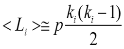
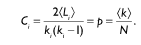
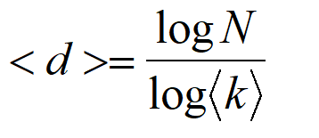
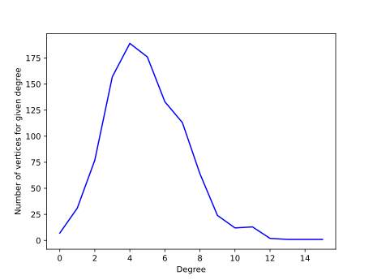
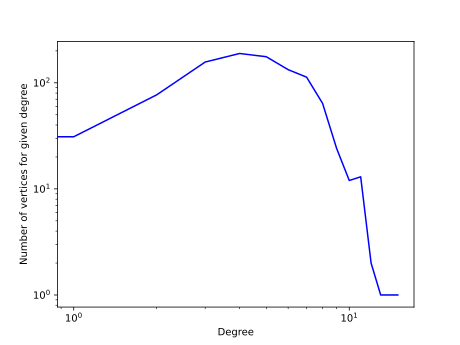
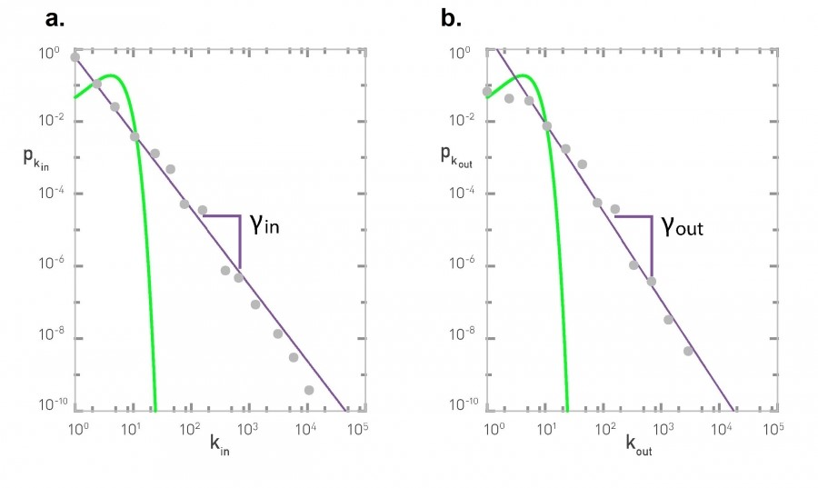

# مدل شبکه تصادفی Erdos-Renyi

شبکه تصادفی مدل Erdős–Rényi دو نوع می‌باشد:
1.	تعریف G(n,M) که یک گراف بصورت تصادفی شامل n گره و M یال می‌باشد.
2.	تعریف G(n,p) که یک گراف بصورت تصادفی شامل n گره بوده و این گراف، هر یالی را با احتمال p مستقل از یال‌های دیگر شامل می‌شود(البته این مدل با عنوان گراف تصادفی (Gilbert, 1959) ارائه شد که در بعضی مراجع به Erdős–Rényi-Gilbert نیز معروف است).

در این پروژه، از نوع دوم استفاده می‌شود.

## ساخت شبکه تصادفی با IGraph
برای ساخت شبکه تصادفی با igraph از دستور زیر استفاده می‌کنیم:
 
def Erdos_Renyi(n, p, m, directed=False, loops=False)
 
پارامتر اول تعداد رأس(n) و پارامتر دوم احتمال وجود هر یال(p) و پارامتر سوم تعداد یال(m) می‌باشد. 
نکته‌ای که باید به آن توجه شود این است که در صورتی بخواهیم شبکه تصادفی از نوع 1 بسازیم باید پارامتر اول و پارامتر سوم مقداردهی شود و اگر شبکه تصادفی از نوع 2 بسازیم، باید پارامتر اول و دوم مقداردهی شود. همچنین برای سادگی در مقایسه خصوصیت‌های شبکه، در این تمرین شبکه تصادفی بصورت ساده و بدون جهت در نظر گرفته شده است. 
با توجه به این که مستندات igraph برای زبان پایتون کامل نیست، پیشنهاد می‌شود از لینک زیر جهت آشنایی با متد‌های موجود در igraph استفاده شود:

https://igraph.org/python/api/latest/igraph._igraph.GraphBase.html#Erdos_Renyi

## توصیف شبکه با کمیت‌های مرکزی
کمیت‌های مرکزی در علم شبکه به ترتیب زیر تعریف می‌شود:
1.	توزیع درجه: احتمال توزیع درجات در کل شبکه می‌باشد.
2.	میانگین طول مسیر: متوسط فواصل بین دو گره(با توجه به یکتا نبودن مسیر بین دو گره، کوتاه‌ترین مسیر در میانگین‌گیری لحاظ می‌شود) .
3.	ضریب خوشه‌پذیری یک گره: بطور خلاصه چگالی اطرافیان گره را می‌سنجد؛ نسبت تعداد یال‌های بین همسایگان به تعداد یال‌های بالقوه بین همسایگان(ترکیب 2 از تعداد همسایگان)
4.	قطر شبکه: بیشترین فاصله بین هر گره در شبکه

ضریب خوشه‌پذیری محلی(Local) چگالی اطراف گره را می‌سنجد که آیا همسایه‌های آن گره، با خود ارتباط(یال) دارند یا نه. برای محاسبه ضریب خوشه‌پذیری لوکال، ابتدا باید میانگین تعداد یال‌های بین همسایگان گره را بدست آوریم؛ یعنی انتخاب 2 از تعداد درجات گره ضرب در احتمال وجود یال:

 

حال ضریب خوشه‌پذیری محلی برابر فرمول زیر است:

 

یعنی نسبت تعداد یال‌های مورد انتظار گره (<L>) به تعداد کل یال‌هایی که می‌تواند وجود داشته باشد (انتخاب ۲ از تعداد درجات گره i) که با جایگذاری <L> در فرمول بالا مقدار p بدست می‌آید. پس ضریب خوشه‌پذیری لوکال مستقل از درجه گره است. همچنین میانگین تمام ضرایب خوشه‌پذیری لوکال نیز برابر p می‌شود(np/n=p). 

ضریب خوشه پذیری عمومی(Global) یعنی همان احتمال اینکه بین هر دو همسایه یک گره، با همدیگر همسایه باشند(یال داشته باشند) که برای گراف تصادفی مدل Erdos-Renyi نوع دوم همان p احتمال وجود یال است.

یعنی در شبکه تصادفی نوع دوم، ضریب خوشه پذیری مستقل از درجه گره می‌باشد.
با تعابیر بالا، در شبکه تصادفی Erdos-Renyi نوع دوم، ضریب خوشه‌پذیری لوکال، گلوبال و میانگین برابر p احتمال وجود یال می‌باشد.

لازم بذکر است این تساوی، فقط در این  حالت یعنی مدل Erdos-Renyi نوع دوم برقرار است.

همچنین متوسط فواصل بین درجات از رابطه زیر بدست می‌آید:
 
  

## رسم نمودار توزیع درجات
برای رسم نمودار توزیع درجات، از کتابخانه matplotlib استفاده شده است. نمودار توزیع درجات با مقیاس معمولی و مقیاس لگاریتم-لگاریتم به شرح زیر می‌‎باشد:

نمودار 1- توزیع فراوانی درجات (مانند توزیع نرمال است)

  

نمودار 2- توزیع فراوانی درجات در مقیاس لگاریتم-لگاریتم (مانند توزیع نرمال است)

  

در نمودار2 در مقایسه با شبکه‌های غیرتصادفی، مشاهده می‌شود که تعداد رئوس با درجه بالا در شبکه‌های تصادفی کمتر از شبکه‌های واقعی است، یعنی شبکه‌های تصادفی از قانون توان یا Power Law پیروی نمی‌کنند (نام دیگر آن قانون 80/20 ویلفردو پرتو بوده که با تعبیر شبکه‌ای بدین صورت است: 80 درصد یال‌های موجود در شبکه توسط 20 درصد از گره‌ها تامین می‌شود). 

همچنین طبق تعریفی که در کتاب علم شبکه(Barabási and Pósfai, 2016) آمده است:
شبکه‌ای که از قانون توان یا power-law پیروی کند Scale-Free نامیده  می‌شود.

نمودار 3- مقایسه بین شبکه های تصادفی و  scale-free (تصویر از کتاب علم شبکه Barabási and Pósfai, 2016) 

  

## مراجع
•	Barabási, A.-L., Pósfai, M., 2016. Network science. Cambridge University Press, Cambridge, United Kingdom.
 
•	Gilbert, E.N., 1959. Random Graphs. Ann. Math. Stat. 30, 1141–1144. https://doi.org/10.1214/aoms/1177706098

